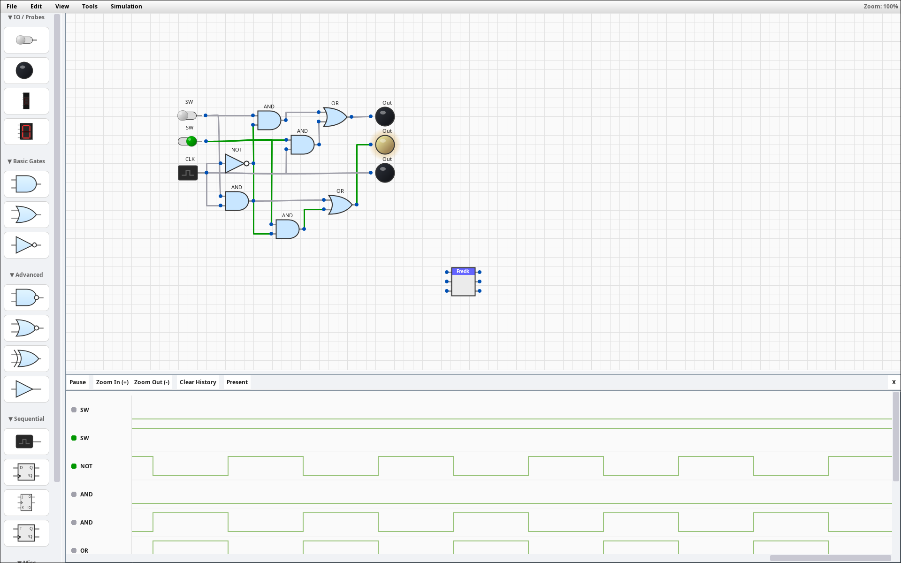

<div align="center">

<h1 style="border-bottom: none;">Logik Simulator</h1>
<p>
<strong>A professional-grade, cross-platform digital logic circuit simulator.</strong>


Design, simulate, and package custom Integrated Circuits with ease.
</p>
  <a href="LICENSE">
    
  </a>
  
  
  
</div>

<br />

<div align="center">

</div>

---

## ⚡ Features

Logik is a robust simulation environment designed for students, hobbyists, and engineers, bridging the gap between theory and real-world digital design.

* **Comprehensive Component Library:**
* **Basic Logic:** AND, OR, NOT, XOR, NAND, NOR, Buffer.
* **Sequential Logic:** D Flip-Flop, T Flip-Flop, JK Flip-Flop, Clock generators.
* **I/O Peripherals:** Switches, Output Probes (LEDs), 7-Segment Displays, Hex Displays.
* **Annotation:** Text labels to document your circuit designs.


* **Dynamic Gate Configuration:** Need a 4-input AND gate? Simply right-click a gate or use the context menu to **add extra input pins** dynamically. No need to cascade multiple 2-input gates.
* **Advanced Simulation Engine:** Real-time, event-driven simulation with adjustable clock speeds (0.5Hz to 50Hz) and variable logic propagation speeds.
* **Timing Diagrams & Logic Analysis:** Visualize signal states over time. This tool allows you to debug race conditions and understand the timing relationships between different parts of your circuit.
* **Gate Propagation Delay:** Enable "Propogation Delay" to simulate real-world propagation delay. Gates take a small amount of time to change state, allowing you to identify and study **hazards** and **glitches** that instant-logic simulators miss. Each gate can have its own custom delay set
* **Auto-Layout:** Messy wires? Use the **Auto-Organise** tool (`Tools` -> `Auto-Organise`) to instantly untangle your circuit. The algorithm intelligently repositions components and routes wires for maximum readability.
* **Custom Integrated Circuits (ICs):** Package complex circuits into reusable "Black Box" chips to build high-level architectures. Supports nesting (chips inside chips).
* **Modern User Experience:** Smooth panning, zooming, snap-to-grid placement, and multi-selection support.
* **State Persistence:** Automatically saves your window state, layout preferences, and last-used theme between sessions.
* **Cross-Platform:** Native installers for Windows and Linux.

---

## 🎨 Custom Themes

Logik features a powerful theming engine that lets you customize every aspect of the UI, from the background grid to the color of a "High" wire signal.

### Built-in Themes

Logik ships with several pre-designed themes, including **Dracula**, **Nord**, **Solarized**, and **Monokai**.

I highly recommend trying the **One Dark** theme for the best balance of contrast and eye comfort during long sessions.

### Creating Your Own Theme

You can create a custom theme by adding a `.properties` file to your `~/.logik/themes/` directory.

**1. Create a file:** e.g., `MyNeonTheme.properties`
**2. Define your colors:** (Use Hex codes)

```properties
# Backgrounds
background=#0f0f1a
grid.major=#2a2a40
grid.minor=#1a1a2e

# Components
component.fill=#1e1e2e
component.border=#bbbbbb
component.pin=#ffffff

# Wires
wire.off=#444455
wire.on=#00ff99     <-- Your custom "High" signal color
wire.selected=#ffcc00

# UI Elements
ui.text=#ffffff
ui.button.bg=#333344
ui.button.hover=#444455

```
(For a full list of attributes refer to one of the builtin [themes](https://github.com/JamieLittle16/LogiK/main/src/main/resources/themes))

**3. Load it:** Restart Logik, and your new theme will appear in the `View` -> `Theme` menu.

---

## 🚀 Installation

### Windows (MSI Installer)

The easiest way to get started on Windows.

1. Download the **`.msi`** installer from the [Releases Page](https://github.com/JamieLittle16/LogiK/blob/main/src/main/resources/themes/one_dark.properties).
2. Double-click to install.
3. Launch **"Logik Simulator"** from your Desktop or Start Menu.
* *Note: Windows may show a "Protected your PC" warning. Click **More Info -> Run Anyway** (this appears because the app is open-source and not digitally signed).*


### Linux (One-Line Install)

Install via terminal with a single command. This handles downloading, extracting, and creating desktop shortcuts automatically.

```bash
curl -sL https://raw.githubusercontent.com/JamieLittle16/LogiK/main/src/main/install.sh | bash

```

To uninstall, simply run:

```bash
curl -sL https://raw.githubusercontent.com/JamieLittle16/LogiK/main/src/main/uninstall.sh | bash

```

Once installed, run `logik` from your terminal or launch it from your Applications menu.

### Portable JAR (Cross-Platform)

For macOS users or those who prefer zero installation:

1. Ensure you have **Java 17** or higher installed.
2. Download `logik-1.2.1-all.jar` from the [Releases Page](https://github.com/JamieLittle16/LogiK/releases).
3. Run via terminal:

```bash
java -jar logik-1.2.1-all.jar

```

---

## 🛠️ Build from Source

If you wish to modify the code or compile it yourself:

```bash
# Clone the repository
git clone https://github.com/JamieLittle16/LogiK.git

# Build the Standalone JAR
./gradlew clean jar

```

The output file will be located in `build/libs/`.

---

## 🎮 Controls & Hotkeys

Logik is designed for speed and efficiency using industry-standard shortcuts.

### Navigation & View

| Action | Mouse | Keyboard |
| --- | --- | --- |
| **Pan View** | Middle Click Drag | `Alt` + Left Click Drag |
| **Zoom In/Out** | Mouse Wheel | `Ctrl` + `+` / `-` |
| **Reset Zoom** |  | `Ctrl` + `0` |
| **Fullscreen** |  | `F11` |

### Editing

| Action | Mouse | Keyboard |
| --- | --- | --- |
| **Select** | Left Click / Drag Box |  |
| **Multi-Select** | `Shift` + Left Click |  |
| **Move Selection (Grid)** | Drag Selection | `Arrow Keys` |
| **Move Selection (Fine)** | | `Shift` + `Arrow Keys` |
| **Place Component** | Left Click (from Palette) |  |
| **Keep Placing** | `Ctrl` + Left Click | |
| **Rotate (90°)** |  | `R` (while placing or selecting) |
| **Rotate (180°)** |  | `Ctrl` + `R` |
| **Delete** |  | `Delete` or `Backspace` |
| **Undo** |  | `Ctrl` + `Z` |
| **Redo** |  | `Ctrl` + `Y` |
| **Cut** |  | `Ctrl` + `X` |
| **Copy** |  | `Ctrl` + `C` |
| **Paste** |  | `Ctrl` + `V` |
| **Rename / Edit Text** | Double Left Click |  |
| **Context Menu** | Right Click |  |
| **Auto-Layout** | | `Ctrl` + `L` |

### Simulation

| Action | Input |
| --- | --- |
| **Toggle Switch** | Left Click on Switch |
| **Manual Step (Tick)** | `T` |
| **Pause Simulation** | `Space` |

---

## 🏗️ Creating Custom ICs

Logik allows you to abstract complex logic into single reusable blocks.

1. **Design** a circuit you want to reuse (e.g., a Full Adder).
2. Place **Switches** for inputs and **Output Lights** for outputs.
* *Note: The vertical order (Top-to-Bottom) of your switches/lights determines the pin order on the final chip.*


3. **Select** the entire circuit using the selection box.
4. **Right-Click** and select `Create Custom IC`.
5. Enter a name (max 5 chars recommended).
6. The new chip will appear in your Palette under "Custom IC". You can now place simulated copies of your circuit instantly.

---

## ⚠️ Known Limitations & Roadmap

We are constantly improving Logik. Here are current limitations to be aware of:

* **Undo/Redo History:** The undo stack is currently limited to 50 steps and may not perfectly track changes made *inside* a custom component definition after it has been created.
* **Circular Dependencies:** Creating a custom IC that contains itself (recursion) will crash the simulation - UI makes this impossible.
* **Printing:** Direct printing support is not implemented; use OS screenshots for now.
* **Truth Tables/Kmap** Some views to aid with logic simplification - hopefully eventually a button that runs Quine McCluskey to produce the simplified logic

If you find any other bugs (or requested features) please open an issue - (or better yet a pull request!)

## 📄 License

This project is licensed under the **GNU General Public License v3.0 (GPLv3)**.
You are free to run, study, share, and modify the software. See `LICENSE` for details.
